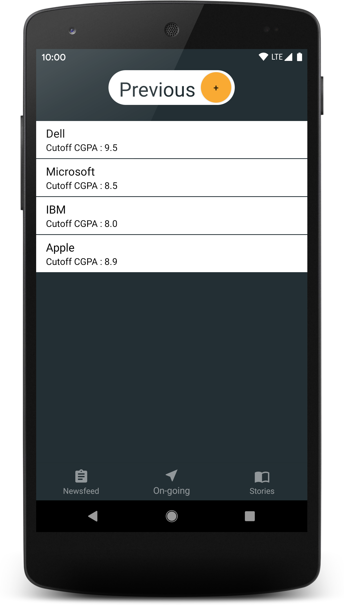
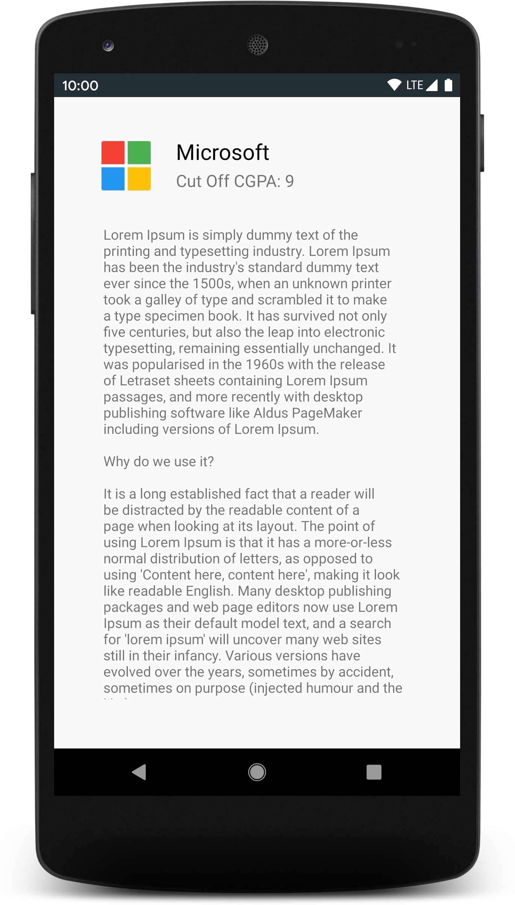

# PlaCell-app
An app to facilitate news sharing between a Placement Cell and students.
My contribution is to manage Layouts and XML file.
### Screenshots
<table>
  <tbody>
    <tr>
      <th>SignUp</th>
      <th>SignIn</th>
      <th>NavDrawer</th>
    </tr>
    <tr>
      <td></td>
      <td></td>
      <td></td>
    </tr>
  </tbody>
</table>

<table>
  <tbody>
    <tr>
      <th>SignIn using SharedPref</th>
      <th>Story</th>
      <th>Story PopUp</th>
    </tr>
    <tr>
      <td></td>
      <td></td>
      <td></td>
    </tr>
  </tbody>
</table>

<table>
  <tbody>
    <tr>
      <th>Ongoing</th>
      <th>Previous</th>
      <th>NewsFeed</th>
    </tr>
    <tr>
      <td></td>
      <td></td>
      <td></td>
    </tr>
  </tbody>
</table>

<table>
  <tbody>
    <tr>
      <th>Ongoing Detail</th>
      <th>NewsFeed PopUp</th>
      <th>Admin Delete PopUp</th>
    </tr>
    <tr>
      <td></td>
      <td></td>
      <td></td>
    </tr>
  </tbody>
</table>
